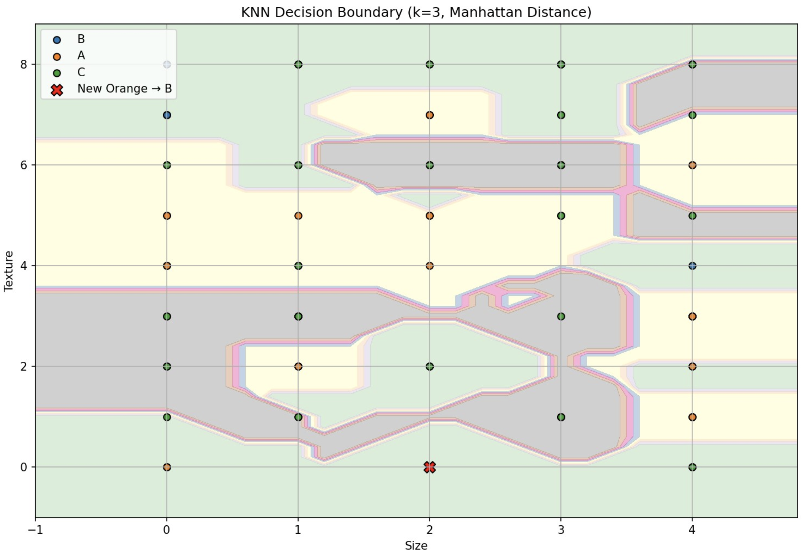

Name: Anukul Pokharel
CRN: 021-310

# KNN 


This project implements a **K-Nearest Neighbors (KNN)** classifier in Python. It includes:
- A **fixed-feature** version (using `Size` and `Texture` only)
- A **generalized** version (flexible number of features)
- Support for **mixed data types** (numeric + ordinal)
- A **visualization** of nearest neighbors using `matplotlib`

---

## What is KNN?

K-Nearest Neighbors is a simple machine learning algorithm that classifies new data points based on the majority class among their `k` closest neighbors from the training data. It’s easy to implement and effective for small datasets.

In this project, we use **Manhattan distance** to measure closeness between data points.

---

## Dataset Description

The dataset is generated synthetically and saved as `mixed_knn_data.csv`. It contains 100 records with the following columns:

| Column         | Type        | Description                                   |
|----------------|-------------|-----------------------------------------------|
| `ID`           | Integer     | Unique identifier for each sample             |
| `Size`         | Numeric     | Integer between 0 and 5                       |
| `TextureValue` | Ordinal     | Encoded texture value: Low=1, Medium=5, High=9|
| `TextureLabel` | Categorical | Human-readable label (Low, Medium, High)      |
| `Category`     | Categorical | Target class label: A, B, or C                |

---

## Implementations

### 1. Fixed-Feature KNN
- Uses only `Size` and `TextureValue`
- Best suited for small, predefined datasets
- Simple and direct implementation

### 2. Generalized KNN
- Accepts a list of features (e.g. `['Size', 'TextureValue']`)
- Works with any number of numeric/ordinal features
- Scalable and more reusable

### 3. Mixed Feature Support
- Ordinal features like texture are encoded into numbers
- Numeric features and ordinal features are treated equally in distance calculation

---

## Distance Metric

We use **Manhattan Distance**:
This is suitable for small datasets and features with discrete or ordinal values.

---

## Visualization

After classification, we generate a bar chart to visualize the **top 10 nearest neighbors** to the new item:

- 🟩 Green bars = top `k` neighbors (used for prediction)  
- 🟧 Orange bars = next closest neighbors  
- Category labels appear above each bar  

---

## Output


### Generalized KNN

```python
feature_columns = ['Size', 'TextureValue']
new_item = [2, 5]  # Example input
k = 5
